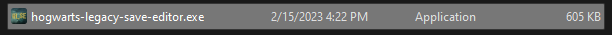
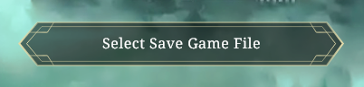
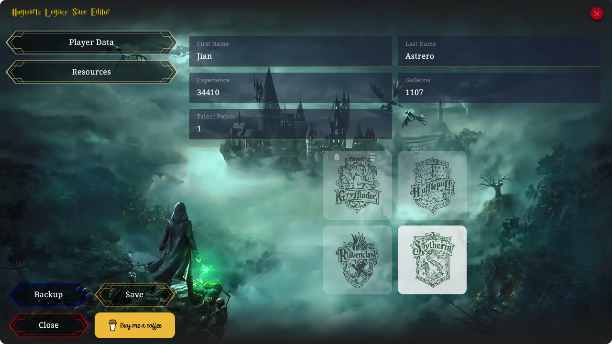
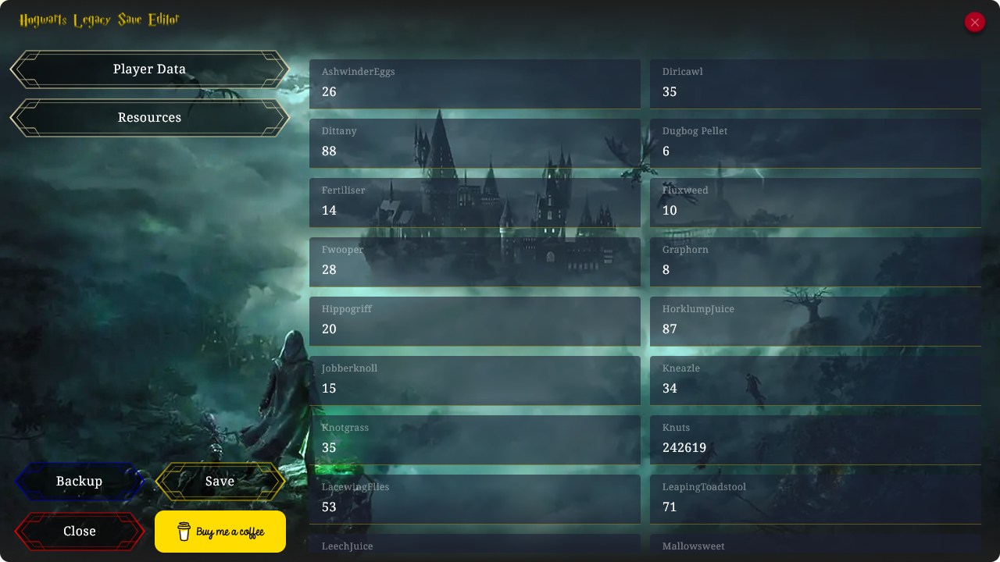

# 🪄 Hogwarts Legacy Save Editor

Edit your hogwarts legacy game files
[**virus total**](https://www.virustotal.com/gui/file/30bc02069c7a29415a4ab52820cffc2677667f2d590157fddf81c8318af90330/detection)

---

### How to use

1. Download latest [release](https://github.com/jianastrero/hogwarts-legacy-save-editor/releases)
2. Extract hogwarts-legacy-save-editor-vx.x.x.zip to a folder
3. Open the application hogwarts-legacy-save-editor.exe
   
4. Select your save game file using the "Select Save Game File" button
   
5. Update the values as you see on the next screen that will show up.
6. (*Optional*) backup your save game in-case you corrupt your save game file or you want to go back to when you didn't apply changes
   * *Note: Backups are found on the same directory as the files on a folder named "backups"*
7. Save the "save file" into your saved games directory
8. Enjoy playing 😁

---

### 🚀 Features
* Load/Save/Backup Hogwarts Legacy Save File
* **Edit Player Data**
  * First Name
  * Last Name
  * Experience
  * Galleons
  * Talent Points
    
* **Edit Inventory Values**
  * Ashwinder Eggs
  * Diricawl
  * Dittany
  * Dugbog Pellet
  * Fertiliser
  * Fluxweed
  * Fwooper
  * Graphorn
  * Hippogriff
  * Horklump Juice
  * Jobberknoll
  * Kneazle
  * Knotgrass
  * LacewingFlies
  * Leaping Toadstool
  * Leech Juice
  * Mallowsweet
  * Mooncalf
  * Moonstone
  * Niffler
  * Phoenix
  * Puffskein
  * Shrivelfig
  * Spider Fang
  * Stench Of The Dead
  * Thestral
  * Toad
  * TrollMucus
  * Unicorn
  * Wolf
    
  *
* Info/Error/Success messages

### 🔮 Planned Features
* ~~**Info/Error/Success messages - The app doesn't show anything as a message for now**~~
* Validation of player data values
* Validation of resource values
* Images for the resources (for easier navigation)
  * If someone could help by sharing their save game file with all items in their inventory so i could update the resources
* Change house
  * Images (for easier navigation)
* Change Appearance
  * Images (for easier navigation)
* Unlock/lock achievements

---

### Support the project

